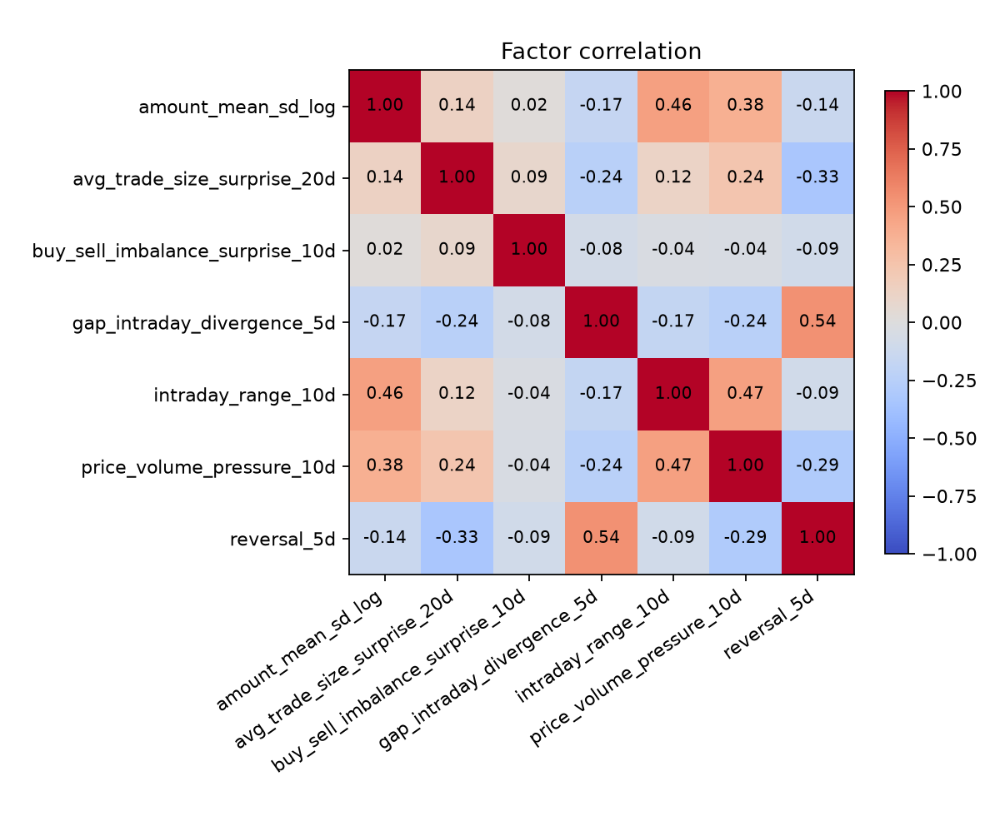
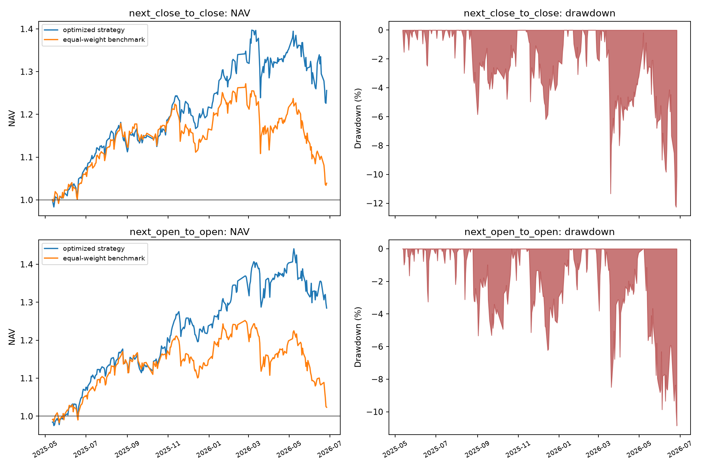
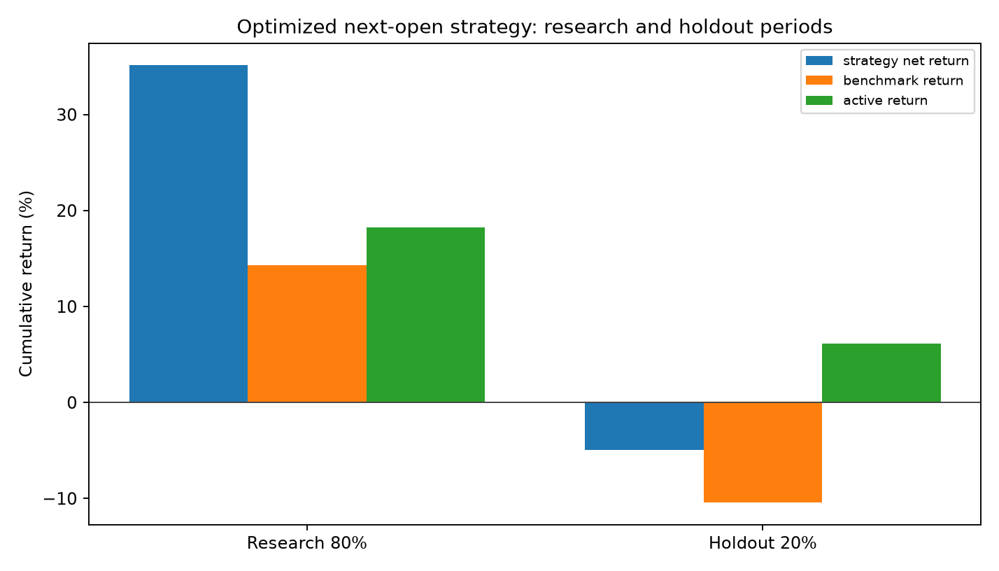

# 七因子扩展与收益优化图文报告

## 结论摘要

正式策略使用七个因子、Top30 持仓、每 5 日调仓和 Top60 持有缓冲。信号在 t 日形成，在 t+1 日成交；因子权重只使用截至 t-1 的 20 日历史 IC。次日开盘口径在手续费、双边滑点、平方根冲击成本、停牌和涨跌停限制全部生效后，累计收益为 **28.46%**，年化收益为 **25.80%**，最大回撤为 **-10.85%**，夏普率为 **1.340**。

完整样本达到 25% 目标，但最后 20% 留出期的绝对收益为 -4.95%，同期基准为 -10.44%，主动收益为 6.13%。因此 25% 是历史完整样本结果，不是未来保证。

## 七个因子的评价

| 因子 | 类别 | IC | Rank IC | Rank ICIR | Q5-Q1累计收益 |
|---|---|---|---|---|---|
| 成交额多窗口均值离散度 | 题目示例因子 | -0.0774 | -0.1070 | -11.711 | -75.86% |
| 10日主动买卖不平衡冲击 | 自建因子 | -0.0314 | -0.0251 | -3.815 | -37.95% |
| 10日日内振幅 | 自建因子 | -0.0396 | -0.0783 | -6.871 | -41.95% |
| 5日反转 | 自建因子 | 0.0303 | 0.0558 | 6.357 | 50.53% |
| 20日单笔成交规模异常 | 新增因子 | -0.0225 | -0.0500 | -8.536 | -36.25% |
| 10日价量压力 | 新增因子 | -0.0424 | -0.0752 | -10.354 | -51.65% |
| 5日隔夜-日内收益背离 | 新增因子 | 0.0324 | 0.0539 | 7.187 | 80.41% |

三个新增因子是 20 日单笔成交规模异常、10 日价量压力、5 日隔夜与日内收益背离。它们不复制参考 PDF 或汇报 PPT 已列出的因子。

## 完整样本风险收益

| 指标 | 次日收盘 | 次日开盘 |
|---|---:|---:|
| 成本前累计收益 | 36.02% | 38.44% |
| 成本后累计收益 | 25.60% | 28.46% |
| 年化收益 | 23.23% | 25.80% |
| 年化超额收益 | 18.98% | 23.15% |
| 年化波动率 | 18.71% | 18.40% |
| 最大回撤 | -12.26% | -10.85% |
| 夏普率 | 1.211 | 1.340 |
| 信息比率 | 1.762 | 1.864 |
| 日均单边换手 | 9.31% | 8.76% |

## 解释边界

- 25% 目标在完整样本次日开盘口径达到，且悲观成本情景的累计收益仍为 27.37%。
- 最后 20% 留出期跑赢下跌的等权基准，但绝对收益仍为负。
- 结果不能视为收益保证；下一步应使用独立的新时间区间继续前推检验。
