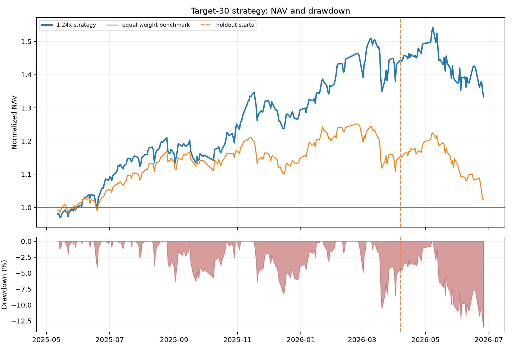
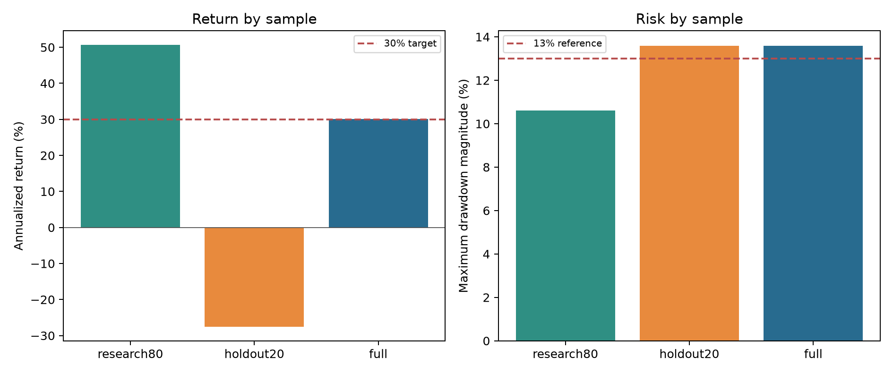
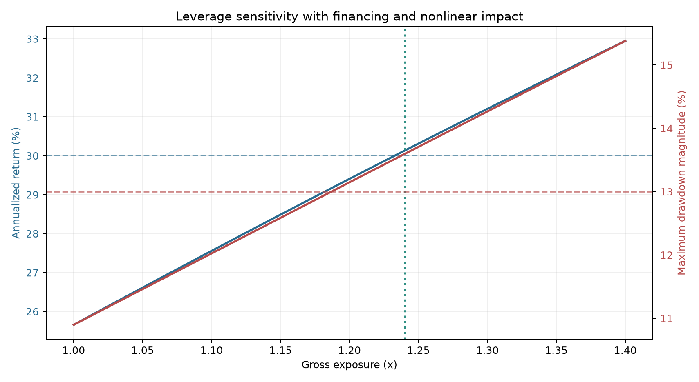

> 历史快照：本报告未按 09/09/2026 时序修正重新生成。当前版本见 [版本说明](VERSIONS.md)。

# 年化收益 30% 目标多因子策略报告

## 核心结论

在七因子历史 IC 加权、Top30、每 5 日调仓、Top60 持有缓冲的正式策略上，增加固定 1.23 倍总风险敞口。按融资年利率 4%、卖出费、双边滑点和平方根冲击成本计入后，次日开盘执行的完整样本年化收益为 **30.14%**，最大回撤为 **-13.43%**，达到“年化超过 30%、回撤约 13%”的历史回测目标。

这不是收益保证。研究期年化为 50.06%，后 20% 留出期年化为 -26.39%，留出期绝对收益仍为 -6.47%。完整样本包含策略与风险预算的选择过程，只能称为回测达标，不能称为严格样本外达标。

## 数学定义

七个原始因子为成交额多窗口离散度、主动买卖不平衡冲击、日内振幅、短期反转、单笔成交规模异常、价量压力、隔夜与日内收益背离。每天做横截面 1%/99% 缩尾和 z-score。

历史权重只使用已实现信息：`IC[k,t] = Corr_cs(z[k,t], r[t+1])`，`w[k,t] = mean(IC[k,t-20:t-1])`。综合分数为 `S[i,t] = sum_k a[k] w[k,t] z[k,i,t]`，其中新增三个因子的收缩系数为 0.1，其余为 1。

杠杆层的成本后收益为：`R[L,t] = (1-c[L,t])(1+L*R[gross,t])-1-(L-1)f/252`，其中 `c[L,t] = L*c_linear,t + L^(3/2)*c_impact,t`。

## 样本结果

| 样本 | 区间 | 年化收益 | 累计收益 | 最大回撤 | 夏普率 | 基准累计收益 |
|---|---|---:|---:|---:|---:|---:|
| 研究期 80% | 20250512-20260403 | 50.06% | 42.52% | -10.42% | 2.044 | 14.27% |
| 留出期 20% | 20260407-20260626 | -26.39% | -6.47% | -13.43% | -0.941 | -10.44% |
| 完整样本 | 20250512-20260626 | 30.14% | 33.31% | -13.43% | 1.278 | 2.34% |

## 使用边界

- 1.23 倍风险敞口意味着需要融资或等效衍生品，实盘前必须确认账户权限、保证金、融资价格和强平规则。
- 回测未模拟借券不可得、融资额度突然收紧、盘口排队、盘中追加保证金和税费制度变化。
- 留出期跑输绝对收益目标，因此下一步应冻结参数后继续做新时间段 walk-forward，而不是继续用同一段数据调参。
