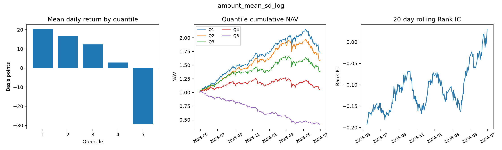
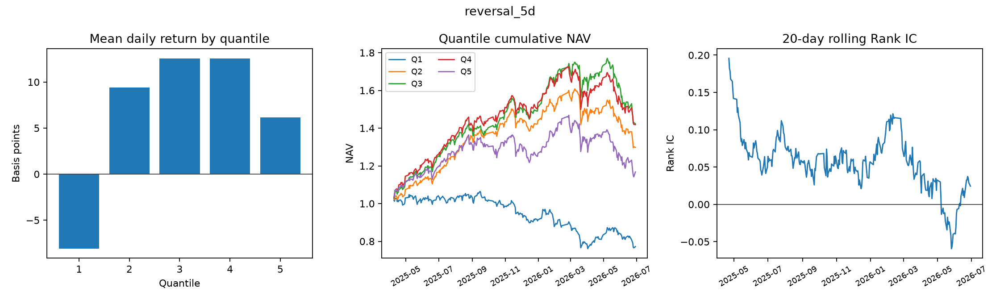
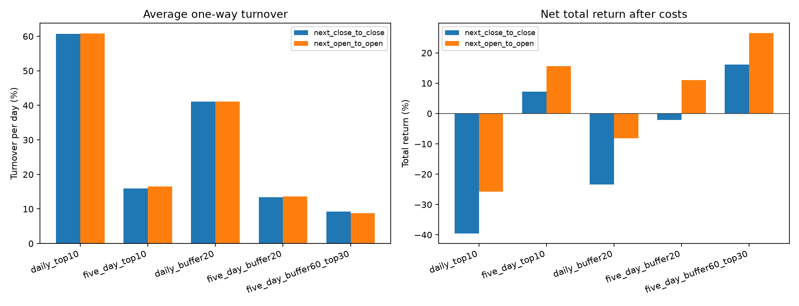
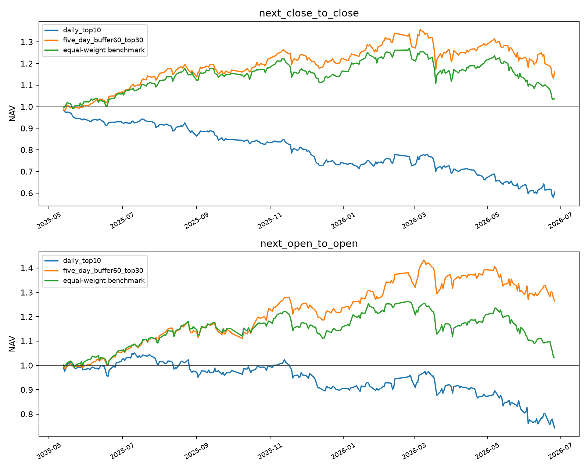
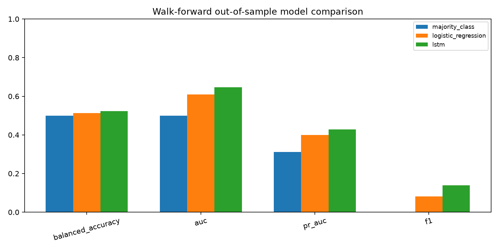
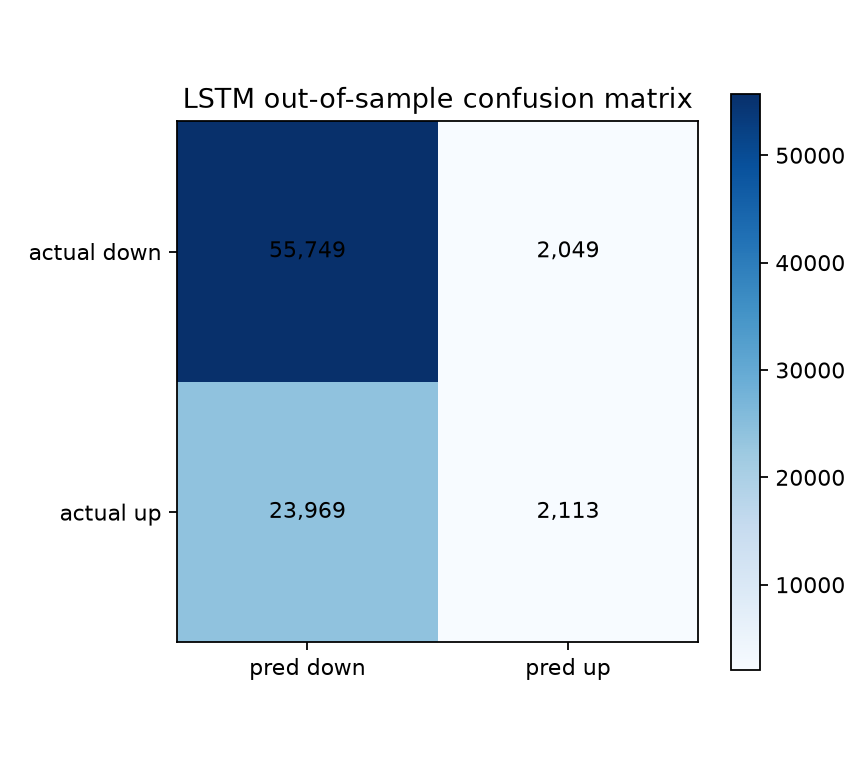

> 历史快照：本报告未按 09/09/2026 时序修正重新生成。当前版本见 [版本说明](VERSIONS.md)。

# 逐笔成交量化作业最终图文报告

## 摘要

项目覆盖 300 只股票、302 个交易日和 11 个基础字段，完成逐笔数据降采样、四因子研究、执行约束回测、换手控制和多股票 walk-forward LSTM。最终采用每 5 日调仓加 Top20 缓冲区，次日开盘口径成本后净收益为 15.83%，累计主动收益为 12.10%，年化超额收益为 11.00%。

## 数据处理

- 日频：11 张 302 x 300 宽表。
- 分钟频：3,322 张 253 x 300 表，包含 15:00。
- 日频 K 线长表：90,600 行。
- 复权价格：`Price / 100 * adjfactor`；成交额按未复权真实价格计算。

## 因子评价

| 因子 | IC | Rank IC | Q5-Q1累计收益 |
|---|---|---|---|
| amount_mean_sd_log | -0.0774 | -0.1070 | -75.86% |
| intraday_range_10d | -0.0396 | -0.0783 | -41.95% |
| price_volume_pressure_10d | -0.0424 | -0.0752 | -51.65% |
| reversal_5d | 0.0303 | 0.0558 | 50.53% |
| gap_intraday_divergence_5d | 0.0324 | 0.0539 | 80.41% |
| avg_trade_size_surprise_20d | -0.0225 | -0.0500 | -36.25% |
| buy_sell_imbalance_surprise_10d | -0.0314 | -0.0251 | -37.95% |

## 回测与换手控制

信号在 t 日形成，在 t+1 日开盘或收盘成交。停牌不可交易，一字涨停不可买入，一字跌停不可卖出。成本包括卖出万分之五、双边 5bp 基础滑点和平方根冲击成本。

最终策略每 5 日调仓，保留仍在前 20 名的原持仓，再补足 10 只股票。

| 成交口径 | 日均单边换手 | 总成本 | 净收益 | 累计主动收益 | 年化超额 |
|---|---|---|---|---|---|
| next_close_to_close | 13.09% | 1,743,568 | 0.23% | -3.54% | -3.24% |
| next_open_to_open | 12.87% | 1,937,164 | 7.27% | 4.81% | 4.40% |

## LSTM样本外验证

LSTM 使用 6 只股票、140 个交易日和 3 折 expanding-window walk-forward，共产生 83,880 条样本外预测。

| 模型 | Accuracy | Balanced Accuracy | F1 | ROC AUC | PR AUC |
|---|---|---|---|---|---|
| majority_class | 68.91% | 50.00% | 0.00% | 0.5000 | 0.3109 |
| logistic_regression | 68.93% | 51.23% | 8.10% | 0.6086 | 0.3993 |
| lstm | 68.98% | 52.28% | 13.97% | 0.6465 | 0.4276 |

## 结论

四因子组合具有成本前选股能力。每日换仓的高换手会使冲击成本吞噬信号收益；每 5 日调仓加 Top20 缓冲区把日均单边换手降至约 12.5%，并使次日开盘执行获得正净收益和正超额收益。LSTM 的排序指标高于逻辑回归，但上涨召回率仍低，需要进一步进行阈值和交易层检验。
