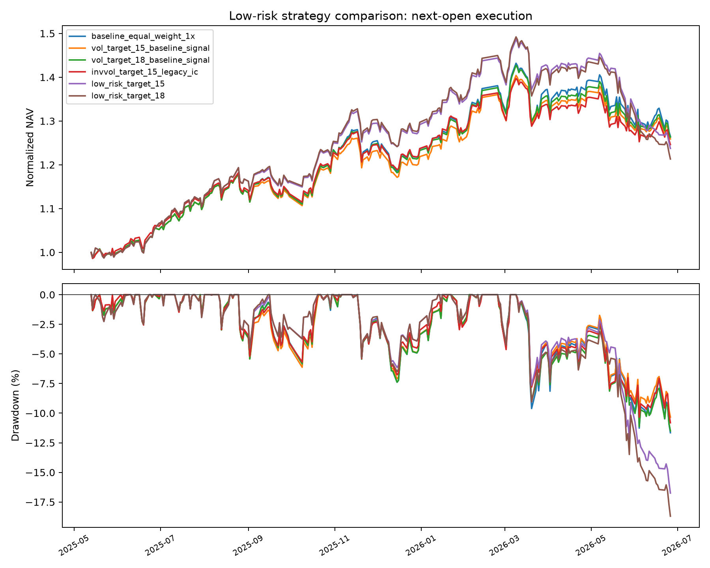

# 降低波动与回撤策略报告

## 实施内容

- 新增 20 日下行波动率、20 日特质波动率和 60 日下行 Beta，方向统一为数值越高风险越低。
- 因子权重使用仅含截至信号日已结束持有期的 IC（按交易日滞后 2 期） 的 60 日 EWMA ICIR，单因子绝对权重上限 25%。
- Top30 风险加权版本使用正向综合得分乘逆 20 日波动率分配；正常可交易的新目标单股上限 4%，涨跌停或停牌冻结仓位可能暂时超过该值。
- 总敞口使用截至信号日已结束持有期的过去 20 个组合收益估计波动率，目标分别为 15% 和 18%，敞口限制在 0.5 至 1.0。
- 所有版本均为每 5 日调仓、Top60 退出缓冲、次日开盘执行，并计入原有费用、滑点与冲击成本。

## 结果对比

| 样本 | 版本 | 年化收益 | 年化波动 | 最大回撤 | Sharpe | Calmar | 最差5日 | 最差20日 | CVaR95 | 平均敞口 |
|---|---|---:|---:|---:|---:|---:|---:|---:|---:|---:|
| research80 | baseline_equal_weight_1x | 41.23% | 17.28% | -9.61% | 2.085 | 4.291 | -8.86% | -7.39% | -2.40% | 100.00% |
| research80 | invvol_target_15_legacy_ic | 38.07% | 15.70% | -7.80% | 2.134 | 4.879 | -7.22% | -6.76% | -2.19% | 94.24% |
| research80 | low_risk_target_15 | 49.25% | 15.62% | -7.65% | 2.643 | 6.442 | -7.16% | -6.15% | -2.15% | 95.08% |
| research80 | low_risk_target_18 | 48.12% | 16.30% | -9.05% | 2.494 | 5.318 | -8.51% | -6.50% | -2.26% | 98.26% |
| research80 | vol_target_15_baseline_signal | 39.24% | 15.85% | -7.74% | 2.169 | 5.071 | -7.11% | -7.10% | -2.18% | 93.97% |
| research80 | vol_target_18_baseline_signal | 40.33% | 16.57% | -8.97% | 2.129 | 4.494 | -8.26% | -7.39% | -2.27% | 97.49% |
| holdout20 | baseline_equal_weight_1x | -25.70% | 22.07% | -9.98% | -1.236 | -2.574 | -5.70% | -9.59% | -3.57% | 100.00% |
| holdout20 | invvol_target_15_legacy_ic | -24.16% | 18.20% | -8.70% | -1.429 | -2.775 | -5.77% | -8.22% | -2.87% | 81.19% |
| holdout20 | low_risk_target_15 | -46.15% | 16.51% | -14.93% | -3.662 | -3.090 | -6.81% | -10.70% | -2.11% | 82.42% |
| holdout20 | low_risk_target_18 | -49.29% | 17.51% | -16.09% | -3.786 | -3.063 | -7.22% | -11.44% | -2.25% | 86.94% |
| holdout20 | vol_target_15_baseline_signal | -23.13% | 18.02% | -8.75% | -1.370 | -2.644 | -5.70% | -8.34% | -2.85% | 81.57% |
| holdout20 | vol_target_18_baseline_signal | -24.32% | 19.36% | -9.15% | -1.343 | -2.659 | -5.70% | -8.77% | -3.02% | 86.74% |
| full | baseline_equal_weight_1x | 24.14% | 18.37% | -11.65% | 1.270 | 2.072 | -8.86% | -9.59% | -2.75% | 100.00% |
| full | invvol_target_15_legacy_ic | 22.43% | 16.27% | -10.81% | 1.326 | 2.074 | -7.22% | -8.22% | -2.41% | 91.62% |
| full | low_risk_target_15 | 21.64% | 15.98% | -16.74% | 1.306 | 1.292 | -7.16% | -10.70% | -2.20% | 92.54% |
| full | low_risk_target_18 | 19.45% | 16.74% | -18.70% | 1.146 | 1.040 | -8.51% | -11.44% | -2.33% | 95.99% |
| full | vol_target_15_baseline_signal | 23.59% | 16.34% | -10.34% | 1.378 | 2.282 | -7.11% | -8.34% | -2.36% | 91.48% |
| full | vol_target_18_baseline_signal | 23.97% | 17.20% | -11.50% | 1.336 | 2.084 | -8.26% | -8.77% | -2.51% | 95.33% |

## 与同次重跑的 1x 基线比较

同次重跑的固定敞口基线为 1.00 倍。15% 波动率目标保留原信号，只调整总敞口；完整样本年化收益由 24.14% 变为 23.59%，但年化波动由 18.37% 变为 16.34%，最大回撤由 -11.65% 变为 -10.34%。

后 20% 留出期中，年化收益由 -25.70% 变为 -23.13%，年化波动由 22.07% 变为 18.02%，最大回撤由 -9.98% 变为 -8.75%。该比较保留原版本名称；本次时序修正不基于留出期重新选择策略。

## 拆解原则

`vol_target_*_baseline_signal` 只改变总敞口；`invvol_target_15_legacy_ic` 再加入个股风险加权；`low_risk_target_*` 才同时启用三项新增风险因子和 60 日 EWMA ICIR。这样可以识别回撤变化究竟来自风险预算还是信号排序。若完整组合在留出期回撤恶化，应视为未通过，不因样本内结果较好而采用。

## 解释边界

研究期和完整样本仍参与了方法选择；留出期只是固定的后 20% 检查，不是重新滚动训练后的严格样本外证明。是否降低风险应优先看留出期的波动、回撤、CVaR 和最差窗口，同时确认收益牺牲是否可接受。
